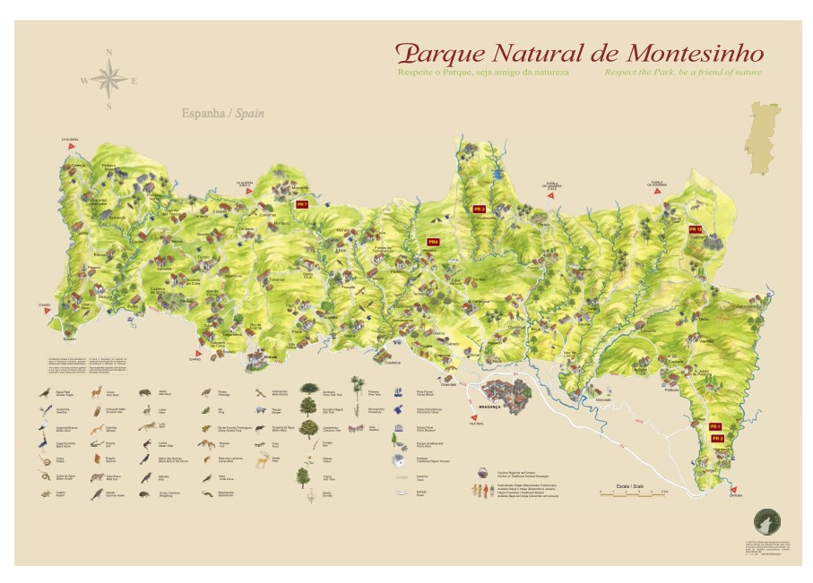

# Linear Regression on Forest Fires

This project builds a linear regression model whose goal is to predict how much area will burn in forest fires using different weather and geographical features from the Forest Fires dataset.

## Data
The Forest Fires Data came from UC Irvine Machine Learning Repository. It has approximately 517 instances with 12 features.
This data is from fire events during Jan2000 – Dec2003 in the Northeast Region of Portugal, specifically Montesinho Park. This data are captures of the conditions during the fire, these conditions influences ignition, spread, and intensity.

> [UC Irvine ML Repo] (https://archive.ics.uci.edu/dataset/162/forest+fires)

Some area specific feature info are listed below, other feature information can be seen on the dataset link:

FFMC (Fine Fuel Moisture Code) --> surface dryness
- measures the moisture of _surface_ litter: twigs, pine needles, dry leaves on the forest floor.

DMC (Duff Moisture Code) --> mid-layer dryness
- measures the moisture of the "duff" (layer of decomposing leaves and organic stuff under the surface).

DC (Drought Code) --> deep dryness
- measures the moisture of deep soil and large logs (think: dryness for weeks or months)

ISI (Initial Spread Index) --> wind + FFMC
- measures the speed a fire grows/spread immediately after ignition

## Exploration
Exploration was started by checking the data and creating boxplots to explore outliers. The we checked the target feature which is area (in hectares), the area distribution is extremely skewed (right skewed) as seen below, using the log function, we are able to make the distribution more less skewed and stabilize variance.

We then went on to exploring the relationships between our target against numerical and non-numerical features, learning that we need to do encoding on month as it shows some seasonal relationship that could be useful for fire ignition and predict overall burned area. 

Our correlation heatmap reveals that the log_area shows weak or almost no linear correlation with any predictors, having that values are close to zero (around 0.01-0.07). This also shows some multicollinearity risks with the fire indices. These are explored and specifically plotted within model.ipynb.

In the end, we learned which features are just noise and would not be very helpful in creating our linear regression model, these are: rain, X, Y, and day.

## Cleaning/Transformation
We dropped duplicates, encoded _month_ feature, log transform our target _(area)_, and dropped noisy columns.

## Linear Regression Model
We explored three linear regression model:
Model 1 - contains data that were from our cleaned forest fires dataset
Model 2 - removed some area outliers
Model 3 - removed dummies

This was done to experiment which model would produce the best model by comparing different linear regression metrics, more specifically R^2.

Since Model 1 performed the best (based on R^2) out of the three models we created, we did a deeper analysis by inspecting its coefficients and check for signs of overfitting. This model consists of 7 features and dummies for the month feature, with 509 rows of data. 

We later converted it the log-transformed area feature into hectares to see the difference.
Although log-transforming the area barely changed the correlation between different features, its still helped us make the skewness better and stabilizing the variance.
This transformation helped us make better sense of the data to analyze and reduce extreme values to better understand meaningful patterns in our data.

## Conclusion

The project ultimately shows the limited predictive powers for estimating burned area using linear regression. Even after exploring, cleaning and engineering the data, the model still struggled to find meaningful relationships.

## Further Improvement and Exploration
The model performed as expected with all the noise and skewness. Possible explorations in the future could be:
- combining features
- analyzing based on seasons
- checking the terrains/vegetations using X,Y coordinates and see if these will help us create a better model for predicting the area of forest fires
- using different ML algorithms
